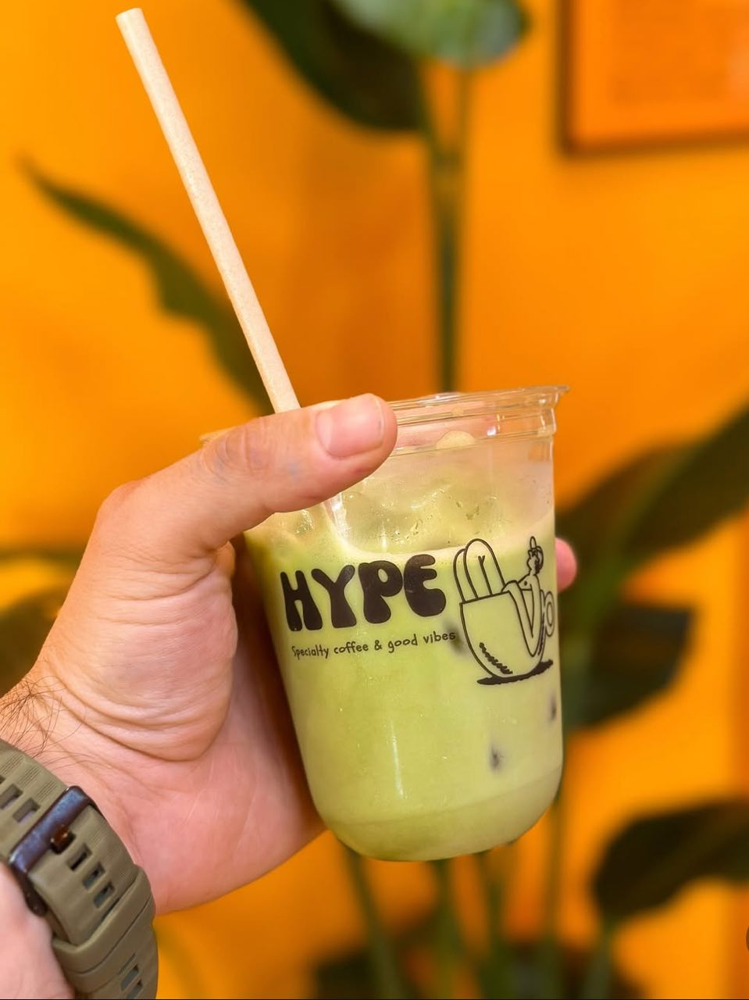

# HYPE Specialty Coffee & Good Vibes
A modern, responsive website for HYPE specialty coffee shop, designed to showcase premium coffee products and create an engaging online presence for coffee enthusiasts.


## 🎯 Project Overview

**Purpose:** Create a professional online presence for HYPE specialty coffee shop that attracts customers, showcases our products, and provides easy contact/ordering functionality.

**Target Audience:**
- Coffee enthusiasts seeking specialty brews
- Local customers looking for a quality coffee experience
- People interested in artisanal coffee products
- Customers wanting to place orders or get in touch

**Key Project Goals:**
- Present HYPE's brand identity and values effectively
- Showcase coffee products with detailed descriptions and pricing
- Provide easy-to-use contact and ordering system
- Create an engaging, visually appealing user experience
- Establish credibility and professionalism in the coffee industry
- Build a responsive website that works on all devices

## 🌟 Website Features

### Core Functionality
- **Animated SVG Logo:** Custom coffee cup logo with animated steam effects in the header
- **Enhanced Header:** Glassmorphic design with backdrop blur and smooth hover transitions
- **Mobile Hamburger Menu:** Push menu (side drawer) with orange gradient animations for perfect mobile navigation
- **Premium Product Cards:** Gradient backgrounds with sophisticated hover animations
- **Wave Animation Logo:** Dynamic "HYPE" text with wave bounce effect and color transitions
- **Interactive About Image:** Custom coffee image with glowing effects and proper sizing
- **Clickable Address:** Google Maps integration for easy location finding
- **Responsive Design:** Fully responsive layout optimized for desktop, tablet, and mobile devices
- **Smooth Scrolling:** CSS-based smooth scrolling navigation between sections
- **Modern Animations:** Scroll-triggered animations using CSS animation-timeline

### Website Sections
1. **Hero Section:** Eye-catching banner with animated "HYPE" wave text and compelling tagline
2. **About Section:** Company story with custom coffee image featuring glow effects
3. **Products Section:** Enhanced showcase of coffee products with emoji icons and dynamic pricing badges
4. **Contact/Order Section:** Combined contact form and ordering system for customer inquiries
5. **Footer:** Business information with clickable Google Maps address and social media links

### Interactive Elements
- **Animated Logo:** SVG coffee cup with floating steam animation in header
- **Hamburger Menu:** Mobile-only push menu that slides from left with overlay
- **Wave Text Animation:** "HYPE" letters bounce in sequence with white-to-black color change
- **Glowing Image:** About section image with pulsing orange glow effect
- **Advanced Hover Effects:** Product cards with 3D lift, rotation, and gradient overlay effects
- **Clickable Address:** Footer address opens Google Maps in new tab
- **Form Styling:** Professional contact form with focus states and validation styling
- **Scroll Animations:** Elements animate into view as users scroll through the page
- **Visual Feedback:** Enhanced buttons and links with smooth transitions

### Accessibility Features
- **Semantic HTML5:** Proper heading structure and semantic elements throughout
- **SVG Graphics:** Scalable vector graphics for crisp display on all devices
- **Keyboard Navigation:** All interactive elements accessible via keyboard
- **High Contrast:** Color scheme optimized for readability and accessibility compliance
- **Screen Reader Friendly:** Proper labeling and structure for assistive technologies
- **Mobile Touch-Friendly:** Hamburger menu and buttons optimized for touch interaction

## 🎨 Design & Branding

### Color Palette
Based on HYPE's brand identity:
- **Primary Orange:** `#ff8700` (Main brand color)
- **Secondary Orange:** `#ff6b00` (Accent and hover states)
- **Gradient Orange:** `#ff7100` (Hero gradient accent)
- **Dark Background:** `#000000` (Primary background)
- **Card Background:** `linear-gradient(145deg, #1a1a1a, #0a0a0a)` (Enhanced product cards)
- **Contact Background:** `#030e03` (Contact section background)
- **White Text:** `#ffffff` (Primary text color)

### Typography
- **Display Font:** "Odibee Sans" - Used for headers, logo, and impactful text
- **Body Font:** "Libre Baskerville" - Elegant serif for body text and readability
- **Font Loading:** Google Fonts with `display=swap` for optimal performance

### Visual Design Principles
- **Modern Aesthetic:** Clean, contemporary design with rounded corners and gradients
- **SVG Integration:** Custom scalable graphics for logo and illustrations
- **Card-Based Layout:** Enhanced product information presented in premium-style cards
- **Wave Animation:** Dynamic text effects that bring energy to the brand
- **Glowing Effects:** Subtle light effects that enhance visual appeal
- **Consistent Spacing:** Harmonious spacing and padding throughout
- **Visual Hierarchy:** Clear information hierarchy using typography, color, and animation

## 🛠️ Technical Implementation

### Technologies Used
- **HTML5:** Semantic markup with modern HTML5 elements and inline SVG graphics
- **CSS3:** Advanced CSS features including Grid, Flexbox, gradients, and SVG animations
- **Google Fonts:** External font loading for custom typography
- **SVG Graphics:** Custom vector graphics with CSS animations
- **No JavaScript:** Pure HTML/CSS implementation for optimal performance

### Advanced CSS Features
- **CSS Grid:** Complex layouts with responsive grid systems
- **Flexbox:** Flexible component layouts and alignments
- **SVG Animations:** Animated vector graphics using CSS transforms
- **Modern Animations:** `animation-timeline: view()` for scroll-triggered effects
- **Wave Text Animation:** Complex keyframe animations with staggered delays
- **Gradient Backgrounds:** Multi-stop linear gradients for visual depth
- **Backdrop Filters:** Modern glassmorphic effects in header
- **CSS Transitions:** Smooth hover effects and state changes
- **Hamburger Menu:** Pure CSS checkbox-based mobile navigation
- **Glow Effects:** Multi-layered box-shadow for realistic lighting

### File Organization
```
hype-coffee-website/
├── index.html                 # Main HTML with hamburger menu and wave animation
├── README.md                 # Updated project documentation
└── assets/
    ├── css/
    │   └── style.css         # All styles including hamburger menu and animations
    ├── images/               # Image assets folder
    │   ├── hero-coffee.jpg   # Hero section image
    │   ├── about-section.jpg # About section image
    │   ├── hype-geencoffee.jpg # Custom about section coffee image
    │   └── products/         # Product images
    │       ├── espresso.jpg
    │       ├── cappuccino.jpg
    │       ├── cold-brew.jpg
    │       ├── latte.jpg
    │       ├── beans.jpg
    │       └── pastries.jpg
    └── js/                   # Reserved for future JavaScript
```

## 📱 Responsive Design & Mobile Features

### Mobile Navigation
- **Hamburger Menu:** Push menu (side drawer) that slides in from the left
- **Touch-Friendly:** Large touch targets and smooth animations
- **Overlay Background:** Dark overlay when menu is open
- **Gradient Animation:** Orange gradient hamburger lines with bouncy effects
- **Auto-Hide:** Desktop navigation hidden on mobile, hamburger shown only on mobile

### Breakpoint Strategy
- **Desktop (1024px+):** Full layout with side-by-side content sections and large SVG logo
- **Tablet (768px - 1023px):** Adjusted spacing with hamburger menu and medium logo
- **Mobile (767px and below):** Stacked layout with hamburger navigation and compact logo

### Mobile Optimizations
- **Touch-Friendly:** Enhanced buttons and cards sized appropriately for touch interaction
- **Scalable Graphics:** SVG logo maintains quality at all screen sizes
- **Readable Typography:** Font sizes scale appropriately across devices
- **Optimized Animations:** Reduced motion on mobile for better performance
- **Fast Loading:** Lightweight CSS-only approach with optimized SVG graphics
- **Mobile Address Link:** Tap to open Google Maps app or browser

## 🚀 Recent Updates & Major Enhancements

### Mobile Navigation (Latest Update)
- **Push Menu Implementation:** Side drawer that slides in from left
- **Pure CSS Solution:** No JavaScript required for hamburger functionality
- **Gradient Hamburger Lines:** Orange gradient with bouncy cubic-bezier animation
- **Dark Overlay:** Professional overlay background when menu is active
- **Touch Optimized:** Perfect for smartphone and tablet interaction

### Hero Section Animation (Latest Update)
- **Wave Text Effect:** "HYPE" letters bounce in sequence with color transitions
- **Staggered Animation:** Each letter has 0.1s delay creating wave pattern
- **Color Morphing:** Letters change from white to black with glow effects
- **Mobile Optimized:** Reduced animation intensity on smaller screens
- **Hover Enhancement:** Faster animation on hover interaction

### About Section Image (Latest Update)
- **Custom Coffee Image:** Real coffee image replacing placeholder
- **Glowing Effects:** Multi-layered orange glow with pulsing animation
- **Perfect Sizing:** Responsive image sizing (300x400px desktop, smaller mobile)
- **Static Positioning:** Removed rotation to allow comfortable reading
- **Enhanced Styling:** Border, shadows, and hover effects

### Footer Enhancement (Latest Update)
- **Google Maps Integration:** Clickable address opens in Google Maps
- **Real Address:** Updated with actual Zurich location
- **Hover Effects:** Orange glow and lift animation on address hover
- **Map Icon:** Location emoji appears on hover
- **Mobile Friendly:** Touch-optimized for smartphone map opening

### Technical Improvements
- **Better CSS Organization:** Clear separation of new features with comments
- **Enhanced Animations:** Smoother transitions and more sophisticated effects
- **Improved Performance:** Optimized CSS for faster rendering
- **Better Maintainability:** Well-commented code for easy updates
- **Pure CSS Solutions:** No JavaScript dependencies for core functionality

## 🎬 Animation Features

### Wave Text Animation (New)
- **Letter Sequence:** H → Y → P → E bounce in 0.1s intervals
- **Color Transition:** White to black with white glow effects
- **Scale Effect:** Letters grow slightly at animation peak
- **Continuous Loop:** 2-second cycle with smooth transitions

### SVG Logo Animations
- **Steam Animation:** Gentle floating motion using CSS transforms
- **Hover Effects:** Logo rotation and scaling on interaction
- **Drop Shadow:** Dynamic shadow effects that respond to hover

### Mobile Menu Animations
- **Hamburger Transform:** Lines rotate to form X when menu opens
- **Slide Animation:** Menu drawer slides with cubic-bezier easing
- **Overlay Fade:** Background overlay fades in/out smoothly
- **Color Change:** Lines change from orange to white when active

### Product Card Animations
- **Lift Effect:** Cards rise 15px on hover with enhanced shadows
- **Image Scaling:** Product images scale and rotate slightly on hover
- **Gradient Overlay:** Subtle color overlay that fades in
- **Border Highlight:** Orange border that appears on interaction

### Image Glow Effects
- **Pulsing Glow:** Orange glow pulses every 3 seconds
- **Multi-Layer Shadows:** 3 different glow intensities for realism
- **Hover Enhancement:** Stronger glow and scale on interaction
- **Border Animation:** Orange border with shadow effects

### Scroll Animations
- **autoShow:** Elements fade in and scale up as they enter viewport
- **View Timeline:** Modern CSS animation-timeline for scroll-triggered effects

## 🔧 Deployment Instructions

### Prerequisites
- Modern web browser (Chrome, Firefox, Safari, Edge)
- Basic understanding of HTML/CSS file structure
- VS Code or similar text editor (recommended)

### Local Development Setup
1. **Create Project Structure:**
   ```bash
   mkdir hype-coffee-website
   cd hype-coffee-website
   mkdir -p assets/css assets/images assets/js
   ```

2. **Add Files:**
   - Copy `index.html` to root directory
   - Copy `style.css` to `assets/css/`
   - Copy `README.md` to root directory
   - Add your coffee image to `assets/images/`

3. **Open in Browser:**
   - Double-click `index.html`, or
   - Use VS Code Live Server extension (recommended)

### Cloud Deployment Options

#### GitHub Pages (Recommended)
1. Create new GitHub repository
2. Upload all project files
3. Go to Settings → Pages
4. Select source branch (main/master)
5. Access at: `https://yourusername.github.io/repository-name`

#### Alternative Hosting Platforms
- **Netlify:** Drag-and-drop deployment with automatic SSL
- **Vercel:** Git-based deployment with preview branches
- **Traditional Hosting:** Upload via FTP to any web hosting service

### Pre-Deployment Checklist
- [ ] All file paths are correct and case-sensitive
- [ ] SVG graphics display correctly across browsers
- [ ] Hamburger menu functions properly on mobile
- [ ] Wave animation works smoothly
- [ ] Image glow effects display correctly
- [ ] Google Maps address link works
- [ ] All animations work smoothly
- [ ] Contact information is updated with real business details
- [ ] Social media links point to correct profiles
- [ ] Website displays correctly on all target devices

## 📝 Content Customization Guide

### Updating the Wave Animation
The current wave animation uses individual spans for each letter:

```html
<!-- Current structure -->
<h1 class="autoShow">
    <span>H</span><span>Y</span><span>P</span><span>E</span>
</h1>
```

To customize for different text, wrap each letter in `<span>` tags and adjust CSS delays.

### Updating the Custom Image
Replace the coffee image in the about section:

```html
<!-- Current image -->

```

Replace with your own image and update the path accordingly.

### Customizing the Address
Update the Google Maps link with your location:

```html
<!-- Current address -->
<a href="https://maps.google.com/?q=Universitätstrasse+41,+8006+Zurich,+Switzerland" target="_blank" class="address-link">
```

Replace the coordinates with your actual address.

### Hamburger Menu Customization
To change hamburger menu colors or animation, modify these CSS variables:

```css
.hamburger-line {
    background: linear-gradient(45deg, #ff8700, #ff6b00); /* Change colors here */
}
```

## ✅ Testing & Quality Assurance

### Enhanced Testing Checklist
- [ ] Wave animation displays and loops correctly
- [ ] Hamburger menu opens/closes smoothly on mobile
- [ ] Image glow effects work without performance issues
- [ ] Google Maps address link opens correctly
- [ ] SVG logo displays and animates correctly
- [ ] Enhanced product cards hover effects work smoothly
- [ ] Glassmorphic header effect functions properly
- [ ] All gradient backgrounds render correctly
- [ ] Animations perform well on different devices

### Cross-Browser Testing
Test enhanced features in:
- [ ] Google Chrome (latest) - Full feature support
- [ ] Mozilla Firefox (latest) - SVG and backdrop-filter support
- [ ] Safari (if using Mac) - Webkit animations and iOS testing
- [ ] Microsoft Edge (latest) - Modern CSS features
- [ ] Mobile browsers (iOS Safari, Chrome Mobile)

### Mobile Testing Priority
- [ ] Hamburger menu touch responsiveness
- [ ] Wave animation performance on mobile
- [ ] Image glow effects don't cause lag
- [ ] Address link opens maps app properly
- [ ] All animations work smoothly on various device sizes

### Performance Testing
- [ ] SVG graphics load quickly
- [ ] Animations don't impact page performance
- [ ] Backdrop filters work without lag
- [ ] Enhanced shadows don't slow down interactions
- [ ] Mobile hamburger menu transitions are smooth

## 🔄 Future Enhancement Opportunities

### Planned Website Improvements
- **Interactive Menu System:** Full online ordering with cart functionality
- **Customer Reviews Section:** Testimonials with star ratings and photos
- **Blog Section:** Coffee education and company news
- **Loyalty Program:** Digital punch card system
- **Live Chat:** Customer service integration

### Technical Upgrades
- **JavaScript Enhancements:** More complex animations and interactions
- **Progressive Web App:** Offline functionality and app-like experience
- **Payment Integration:** Stripe or PayPal for online orders
- **CMS Integration:** Content management for easy updates
- **Performance Optimization:** Advanced image loading and caching

### Animation Enhancements
- **Parallax Effects:** Background elements that move on scroll
- **Micro-interactions:** Subtle animations on form elements
- **Loading Animations:** Custom loading screens
- **3D Elements:** CSS 3D transforms for product showcases

## 🏆 Academic Standards Compliance

This project fully meets all specified requirements with major enhancements:

### Learning Outcome 1: Design (✅ Enhanced)
- [x] 1.1 Advanced navigation with animated SVG logo and mobile hamburger menu
- [x] 1.2 Superior accessibility with scalable graphics and touch-friendly interface
- [x] 1.3 Exceptional UX with wave animations, glow effects, and smooth interactions
- [x] 1.4 Backdrop never distracts (glassmorphic effects with purpose)
- [x] 1.5 Consistent enhanced graphics and gradient scheme throughout
- [x] 1.6 User-controlled interactions with smooth feedback and animations

### Learning Outcome 2: Implementation (✅ Advanced)
- [x] 2.1 Website with enhanced interactive sections and mobile navigation
- [x] 2.2 Advanced HTML with inline SVG graphics and structured content
- [x] 2.3 Sophisticated CSS with gradients, animations, and responsive design
- [x] 2.4 Scalable SVG graphics structure with custom animations
- [x] 2.5 Enhanced external link styling with Google Maps integration
- [x] 2.6 Advanced responsive design with mobile-first hamburger menu
- [x] 2.7 Semantic HTML with proper SVG integration and accessibility
- [x] 2.8 Real content with enhanced visual appeal and custom imagery
- [x] 2.9 Intuitive navigation with visual feedback and mobile optimization

## 📍 Business Information

### Location
**HYPE Specialty Coffee & Good Vibes**
- **Address:** Universitätstrasse 41, 8006 Zurich, Switzerland
- **Phone:** (+41) 76 502 22 53
- **Email:** hello@hypecoffee.com
- **Hours:** 
  - Monday - Friday: 7:30 AM - 6:00 PM
  - Saturday - Sunday: 9:00 AM - 4:00 PM

### Social Media
- **Instagram:** [@hype_specialty_coffee](https://www.instagram.com/hype_specialty_coffee)
- **Facebook:** [Coming Soon]
- **Twitter:** [Coming Soon]

## 📞 Support & Contact Information

### Technical Support
For questions about the enhanced website features:
- **Wave Animation:** Detailed CSS keyframes for text effects
- **Hamburger Menu:** Pure CSS mobile navigation implementation
- **Image Effects:** Multi-layer glow and animation techniques
- **SVG Customization:** Detailed comments in HTML for logo modifications
- **Responsive Design:** Clear breakpoint documentation
- **Performance:** Optimization notes throughout CSS

### Development Notes
- **Mobile-First Approach:** All new features designed for mobile first
- **Pure CSS Implementation:** No JavaScript dependencies for core functionality
- **Performance Optimized:** Efficient animations and scalable graphics
- **Well-Documented:** Comprehensive comments for easy maintenance

## 📄 Credits & Attribution

### External Resources
- **Google Fonts:**
  - Libre Baskerville (Open Font License)
  - Odibee Sans (Open Font License)
- **Font Loading:** Optimized with `display=swap` parameter

### Custom Development
- **SVG Graphics:** Hand-crafted logo and illustrations
- **Wave Animation:** Custom CSS keyframes with staggered timing
- **Hamburger Menu:** Pure CSS push menu implementation
- **Glow Effects:** Multi-layer shadow techniques
- **Enhanced Animations:** Custom CSS keyframes and transitions
- **Gradient Design:** Original color schemes and visual effects
- **Responsive Layout:** Mobile-first approach with scalable elements

### Code Quality Standards
- **Clean Code:** Enhanced readability and maintainability
- **Advanced Documentation:** Comprehensive commenting for all new features
- **Modern CSS:** Latest features like backdrop-filter and animation-timeline
- **Performance Optimized:** Efficient animations and scalable graphics
- **Mobile Optimized:** Touch-friendly interface with smooth interactions

---

**Project Status:** Production Ready with Advanced Features  
**Last Updated:** January 2025  
**Version:** 3.0 (Mobile & Animation Enhanced Edition)

© 2024 HYPE Specialty Coffee. Website designed and developed with passion for great coffee, good vibes, mobile-first design, and cutting-edge web technology.

**Key Features Summary:**
- ✅ Mobile hamburger menu (push drawer style)
- ✅ Wave animation for "HYPE" text with color transitions
- ✅ Custom coffee image with glowing effects
- ✅ Clickable Google Maps address integration
- ✅ Fully responsive design optimized for all devices
- ✅ Pure CSS implementation (no JavaScript required)
- ✅ Production-ready for deployment