# HYPE Specialty Coffee & Good Vibes

A modern, responsive website for HYPE specialty coffee shop, designed to showcase premium coffee products and create an engaging online presence for coffee enthusiasts.

## Table of Contents

- [Project Overview](#project-overview)
- [Website Features](#website-features)
- [Design & Branding](#design--branding)
- [Technical Implementation](#technical-implementation)
- [Responsive Design & Mobile Features](#responsive-design--mobile-features)
- [Animation Features](#animation-features)
- [Deployment Instructions](#deployment-instructions)
- [Content Customization Guide](#content-customization-guide)
- [Testing & Quality Assurance](#testing--quality-assurance)
- [Future Enhancement Opportunities](#future-enhancement-opportunities)
- [Business Information](#business-information)
- [Credits & Attribution](#credits--attribution)
- [References & Learning Resources](#references--learning-resources)

## Project Overview

**Purpose:** Create a professional online presence for HYPE specialty coffee shop that attracts customers, showcases our products, and provides easy contact/ordering functionality.

**Live Website:** [See deployed website](https://stevedok22.github.io/Hype-coffee/)

<div align="center">

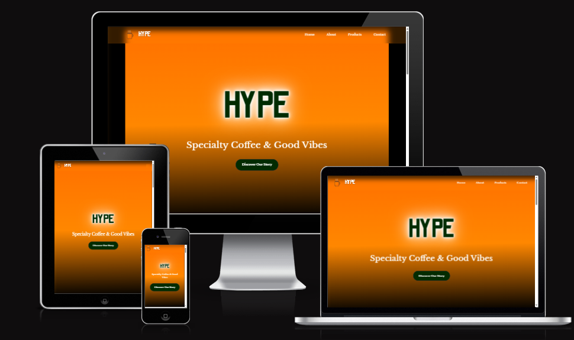

*HYPE Coffee website displayed across multiple devices - showcasing responsive design*

</div>

**Target Audience:** 
- Coffee enthusiasts seeking specialty brews
- Local customers looking for a quality coffee experience
- People interested in artisanal coffee products
- Customers wanting to place orders or get in touch

**Key Project Goals:**
- Present HYPE's brand identity and values effectively
- Showcase coffee products with detailed descriptions and pricing
- Provide easy-to-use contact and ordering system
- Create an engaging, visually appealing user experience
- Establish credibility and professionalism in the coffee industry
- Build a responsive website that works on all devices

## Website Features

### Core Functionality

<div align="center">

#### Animated Logo and Branding

| Neon Logo Effect | Logo Animation |
|------------------|----------------|
|  | 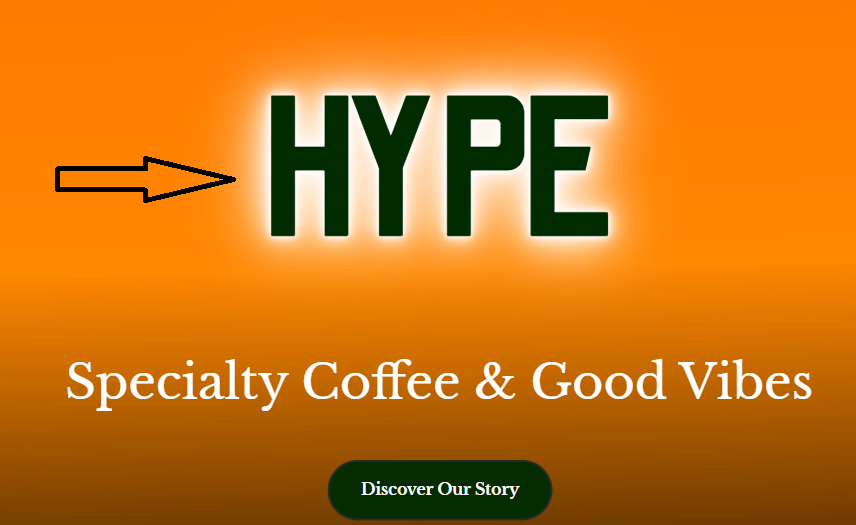 |

*Custom SVG coffee cup logo with animated steam effects and pulsing "HYPE" neon text*

</div>

- **Animated SVG Logo:** Custom coffee cup logo with animated steam effects in the header and pulsing "HYPE" neon text
- **Enhanced Header:** Glassmorphic design with backdrop blur and smooth hover transitions
- **Mobile Hamburger Menu:** Push menu (side drawer) with orange gradient animations for perfect mobile navigation

<div align="center">

#### Mobile Navigation System

| Menu Closed | Menu Open |
|------------|-----------|
| 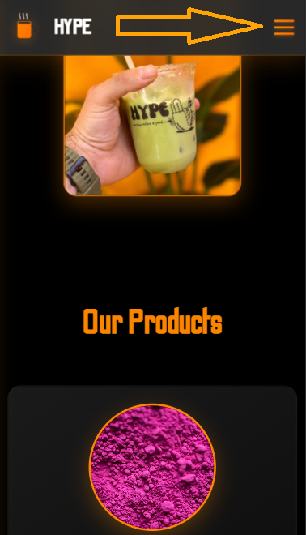 | 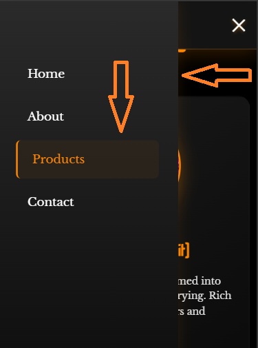 |

*Smooth slide-out mobile navigation with hamburger menu animation*

</div>

- **Premium Product Cards:** Gradient backgrounds with sophisticated hover animations and improved text visibility

<div align="center">

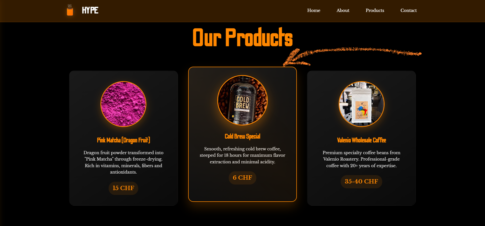

*Interactive product cards with lift effects and enhanced visual feedback*

</div>

- **Neon Pulse Animation:** Dynamic "HYPE" text with pulsing white neon glow effect
- **Interactive About Image:** Custom coffee image with glowing effects and proper sizing
- **Clickable Address:** Google Maps integration for easy location finding
- **Responsive Design:** Fully responsive layout optimized for desktop, tablet, and mobile devices
- **Smooth Scrolling:** CSS-based smooth scrolling navigation between sections
- **Modern Animations:** Scroll-triggered animations using CSS animation-timeline
- **Cross-Page Navigation:** Order buttons from product pages redirect to main contact form

### Website Sections
- **Hero Section:** Eye-catching banner with animated "HYPE" neon pulse text and compelling tagline
- **About Section:** Company story with custom coffee image featuring glow effects
- **Products Section:** Streamlined showcase of three core products with enhanced visibility
- **Contact/Order Section:** Combined contact form and ordering system for customer inquiries

<div align="center">

#### Contact Form Features

| Form Layout | Dynamic Features |
|------------|------------------|
| 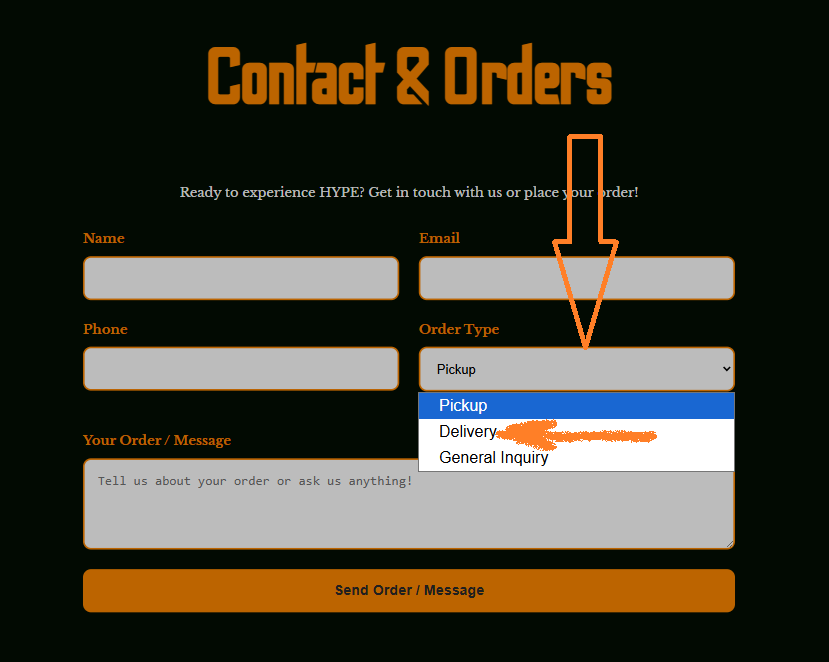 | 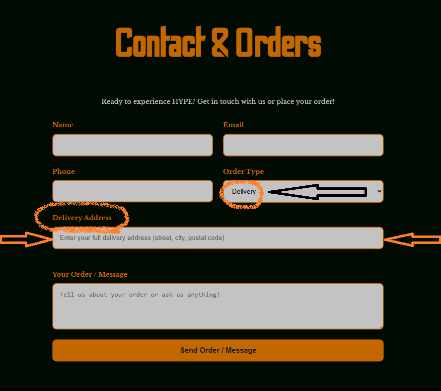 |

*Professional contact form with dynamic address field and order type selection*

</div>

- **Footer:** Business information with clickable Google Maps address and social media links

### Product Pages

<div align="center">

#### Three Core Product Offerings

| Pink Matcha | Cold Brew | Valenio Coffee |
|------------|-----------|----------------|
| 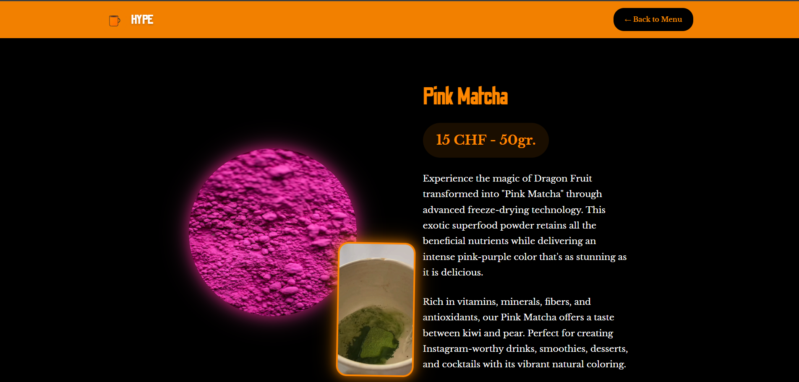 | 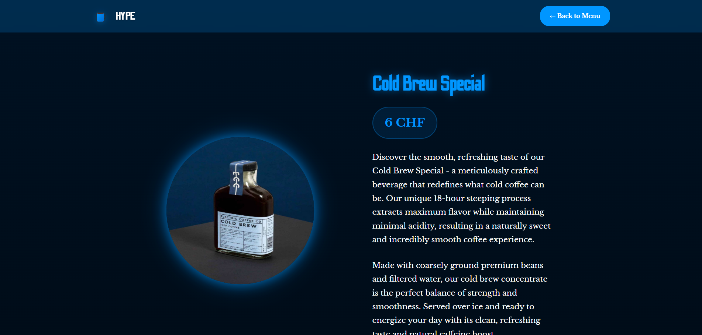 | 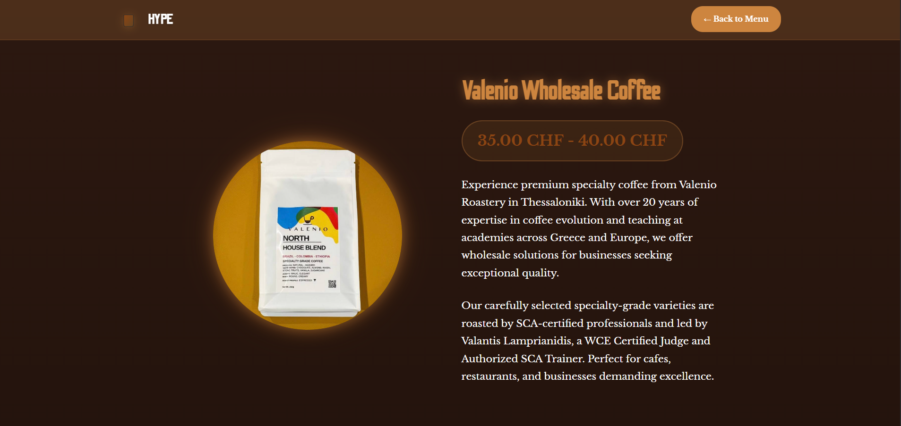 |
| **Dragon Fruit Superfood** | **18-Hour Cold Brew Process** | **Professional Wholesale Coffee** |

*Dedicated product pages with detailed information, videos, and ordering integration*

</div>

- **Pink Matcha (Dragon Fruit):** Exotic superfood powder with video integration and vertical video window
- **Cold Brew Special:** 18-hour cold brew process with detailed timeline and benefits
- **Valenio Wholesale Coffee:** Professional coffee beans with expertise showcase and video content

### Interactive Elements
- **Animated Logo:** SVG coffee cup with floating steam animation in header
- **Hamburger Menu:** Mobile-only push menu that slides from left with overlay
- **Neon Pulse Animation:** "HYPE" text with pulsing white glow effect around black text
- **Glowing Image:** About section image with pulsing orange glow effect
- **Advanced Hover Effects:** Product cards with 3D lift, rotation, and gradient overlay effects
- **Clickable Address:** Footer address opens Google Maps in new tab
- **Form Styling:** Professional contact form with focus states and validation styling
- **Scroll Animations:** Elements animate into view as users scroll through the page
- **Visual Feedback:** Enhanced buttons and links with smooth transitions
- **Video Integration:** Vertical video window in Pink Matcha product page

### Accessibility Features
- **Semantic HTML5:** Proper heading structure and semantic elements throughout
- **SVG Graphics:** Scalable vector graphics for crisp display on all devices
- **Keyboard Navigation:** All interactive elements accessible via keyboard
- **High Contrast:** Improved text visibility with enhanced color schemes
- **Screen Reader Friendly:** Proper labeling and structure for assistive technologies
- **Mobile Touch-Friendly:** Hamburger menu and buttons optimized for touch interaction

## Design & Branding

### Color Palette

<div align="center">

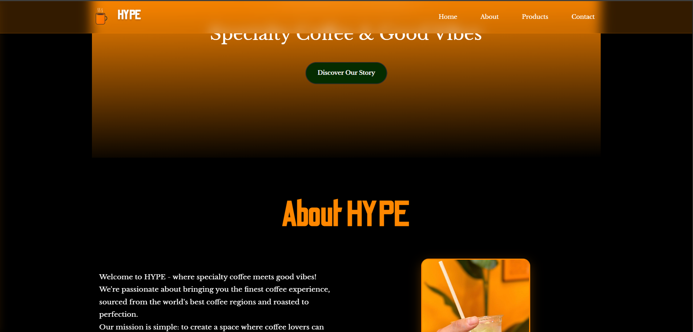

*HYPE's signature orange and black color scheme implemented throughout the website*

</div>

Based on HYPE's brand identity:
- **Primary Orange:** `#ff8700` (Main brand color)
- **Secondary Orange:** `#ff6b00` (Accent and hover states)
- **Gradient Orange:** `#ff7100` (Hero gradient accent)
- **Dark Background:** `#000000` (Primary background)
- **Card Background:** `linear-gradient(145deg, #1a1a1a, #0a0a0a)` (Enhanced product cards)
- **Contact Background:** `#030e03` (Contact section background)
- **White Text:** `#ffffff` (Primary text color)
- **Enhanced Text:** `#e0e0e0` (Improved visibility for product descriptions)

### Typography
- **Display Font:** "Odibee Sans" - Used for headers, logo, and impactful text
- **Body Font:** "Libre Baskerville" - Elegant serif for body text and readability
- **Font Loading:** Google Fonts with display=swap for optimal performance

### Visual Design Principles

<div align="center">

#### Design Elements Showcase

| Modern Aesthetic | Card-Based Layout |
|------------------|------------------|
| 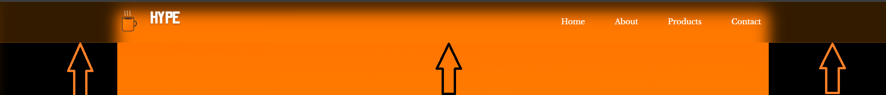 |  |

| Neon Effects | Visual Hierarchy |
|--------------|------------------|
| 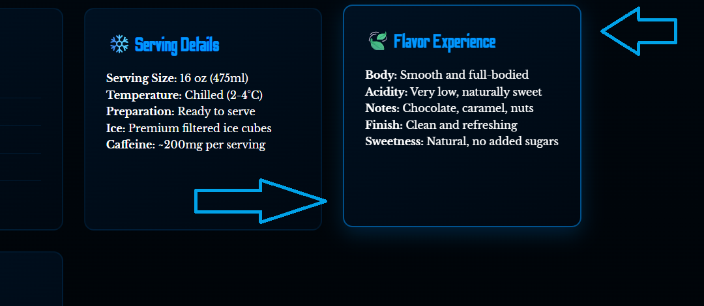 |  |

*Visual design system showcasing modern aesthetic, premium cards, neon effects, and clear hierarchy*

</div>

- **Modern Aesthetic:** Clean, contemporary design with rounded corners and gradients
- **SVG Integration:** Custom scalable graphics for logo and illustrations
- **Card-Based Layout:** Enhanced product information presented in premium-style cards

<div align="center">

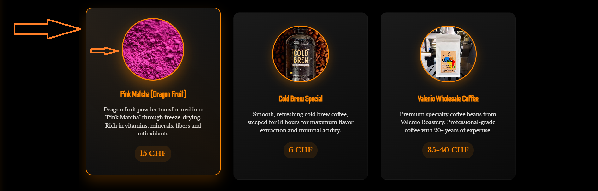

*Consistent spacing and improved readability with proper contrast and shadows*

</div>

- **Neon Effects:** Dynamic pulsing glow effects that bring energy to the brand
- **Glowing Effects:** Subtle light effects that enhance visual appeal
- **Consistent Spacing:** Harmonious spacing and padding throughout
- **Visual Hierarchy:** Clear information hierarchy using typography, color, and animation
- **Improved Readability:** Enhanced text visibility with proper contrast and shadows

## Technical Implementation

### Technologies Used
- **HTML5:** Semantic markup with modern HTML5 elements and inline SVG graphics
- **CSS3:** Advanced CSS features including Grid, Flexbox, gradients, and SVG animations
- **Google Fonts:** External font loading for custom typography
- **SVG Graphics:** Custom vector graphics with CSS animations
- **Minimal JavaScript:** Only for form functionality and mobile menu interactions

### Advanced CSS Features
- **CSS Grid:** Complex layouts with responsive grid systems
- **Flexbox:** Flexible component layouts and alignments
- **SVG Animations:** Animated vector graphics using CSS transforms
- **Modern Animations:** animation-timeline: view() for scroll-triggered effects
- **Neon Pulse Animation:** Complex keyframe animations with pulsing glow effects
- **Gradient Backgrounds:** Multi-stop linear gradients for visual depth
- **Backdrop Filters:** Modern glassmorphic effects in header
- **CSS Transitions:** Smooth hover effects and state changes
- **Hamburger Menu:** Pure CSS checkbox-based mobile navigation
- **Glow Effects:** Multi-layered box-shadow for realistic lighting
- **Text Shadows:** Enhanced text visibility with strategic shadow placement

### File Organization
```
hype-coffee-website/
├── index.html                     # Main HTML with three products
├── pink-matcha.html              # Dragon Fruit product page with video
├── cold-brew-special.html        # Cold brew product page
├── valenio-wholesale.html        # Wholesale coffee product page
├── README.md                     # Project documentation
└── assets/
    ├── css/
    │   └── style.css            # Enhanced styles with improved visibility
    ├── images/                  # Image assets folder
    │   ├── hero-coffee.jpg      # Hero section image
    │   ├── hype-geencoffee.jpg  # About section coffee image
    │   └── products/            # Product images
    └── videos/                  # Video assets for Pink Matcha
```

## Responsive Design & Mobile Features

### Mobile Navigation
- **Hamburger Menu:** Push menu (side drawer) that slides in from the left
- **Touch-Friendly:** Large touch targets and smooth animations
- **Overlay Background:** Dark overlay when menu is open
- **Gradient Animation:** Orange gradient hamburger lines with bouncy effects
- **Auto-Hide:** Desktop navigation hidden on mobile, hamburger shown only on mobile

### Breakpoint Strategy

<div align="center">

#### Cross-Device Compatibility Testing

| Desktop (1024px+) | Tablet (768px - 1023px) | Mobile (767px and below) |
|-------------------|-------------------------|-------------------------|
| 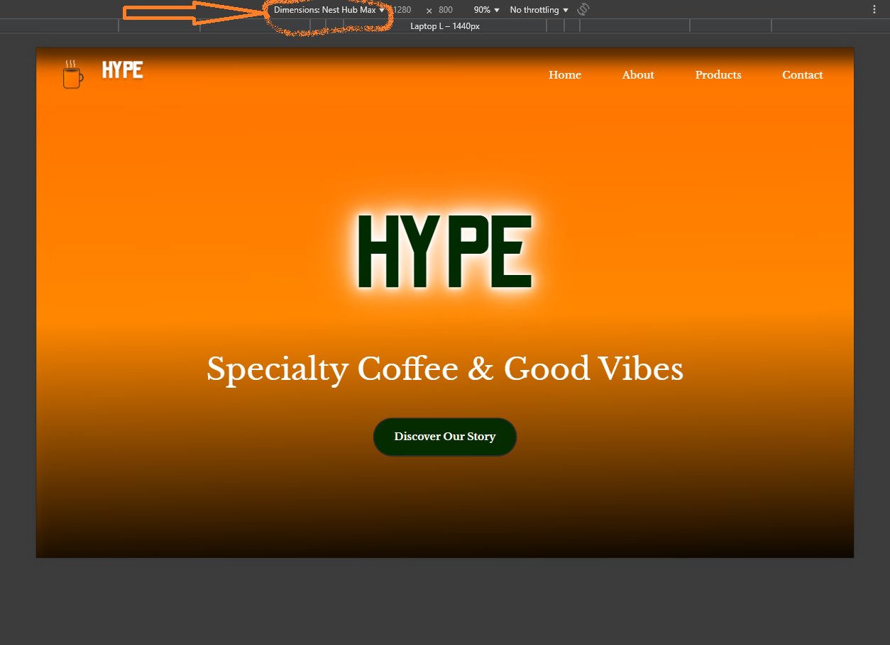 | 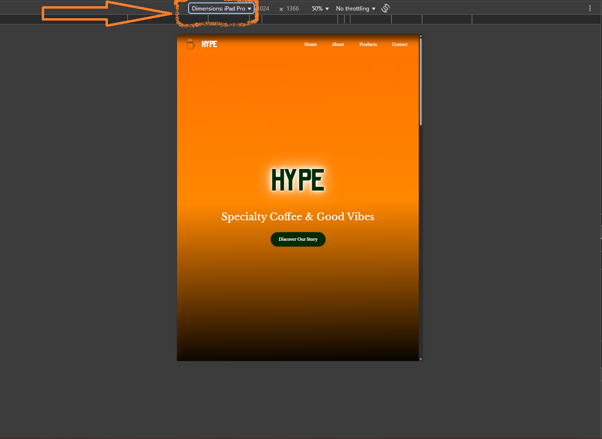 | 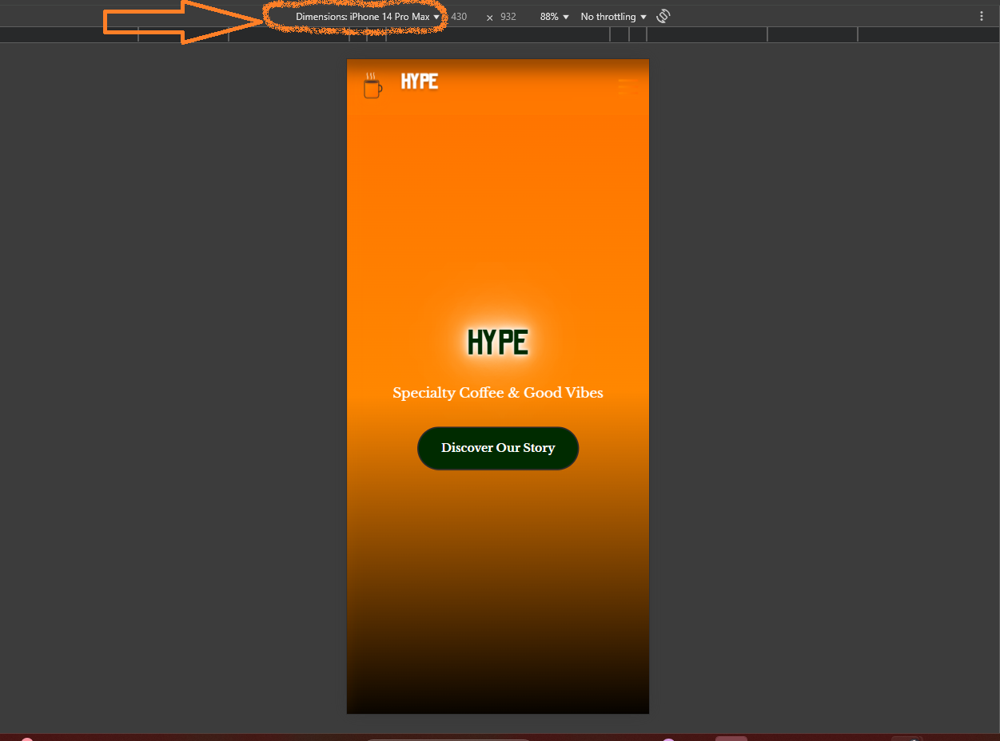 |
| **Full layout with side-by-side content** | **Adjusted spacing with hamburger menu** | **Stacked layout with compact design** |

*Responsive design tested across all major device categories*

</div>

- **Desktop (1024px+):** Full layout with side-by-side content sections and large SVG logo
- **Tablet (768px - 1023px):** Adjusted spacing with hamburger menu and medium logo
- **Mobile (767px and below):** Stacked layout with hamburger navigation and compact logo

### Mobile Optimizations
- **Touch-Friendly:** Enhanced buttons and cards sized appropriately for touch interaction
- **Scalable Graphics:** SVG logo maintains quality at all screen sizes
- **Readable Typography:** Font sizes scale appropriately across devices with improved contrast
- **Optimized Animations:** Reduced motion on mobile for better performance
- **Fast Loading:** Lightweight CSS-only approach with optimized SVG graphics
- **Mobile Address Link:** Tap to open Google Maps app or browser
- **Vertical Video Support:** Responsive video container for mobile viewing

## Major Enhancements

### Video Integration Enhancement

<div align="center">

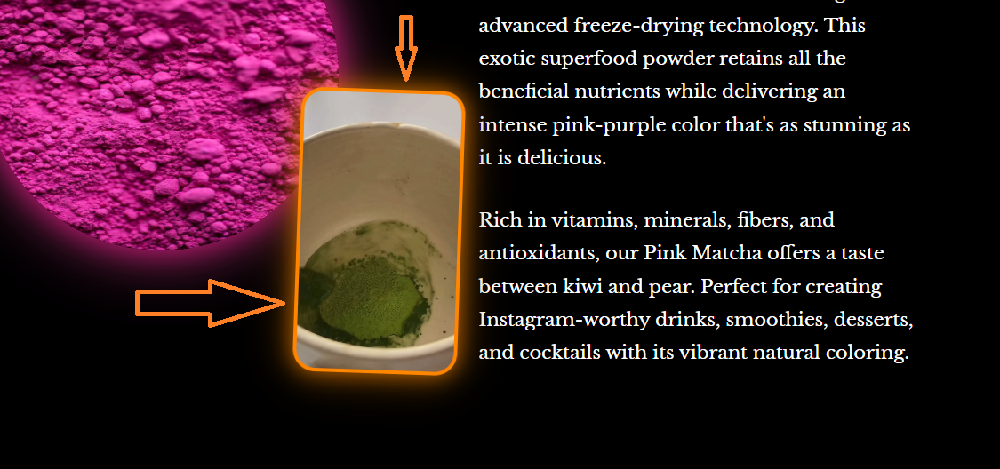
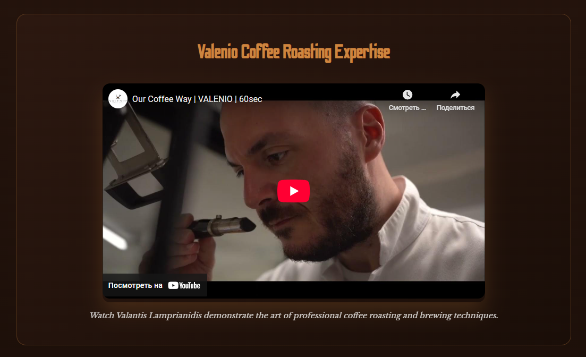

*Vertical video window with floating animation and responsive design for Pink Matcha product*

</div>

- **Pink Matcha Video:** Vertical video window (180×320px) with orange glow effects
- **Floating Animation:** Smooth floating animation for video container
- **Responsive Video:** Adapts to different screen sizes (200×360px tablet, 160×290px mobile)
- **Professional Styling:** Rounded corners, shadows, and gradient borders

### Text Visibility Improvements
- **Enhanced Product Descriptions:** Improved color (`#e0e0e0`) and text shadows for better readability
- **Contrast Optimization:** Strategic use of shadows and background colors
- **Typography Refinements:** Better font sizing and line spacing

### Navigation & UX Enhancements
- **Seamless Ordering:** Order buttons from product pages lead directly to contact form
- **Improved Mobile Experience:** Better touch targets and responsive design
- **Cross-Platform Consistency:** Uniform experience across all devices

## Animation Features

### Neon Pulse Animation (Featured)

<div align="center">

#### Dynamic Neon Text Effects

| Base State | Peak Pulse |
|-----------|------------|
| 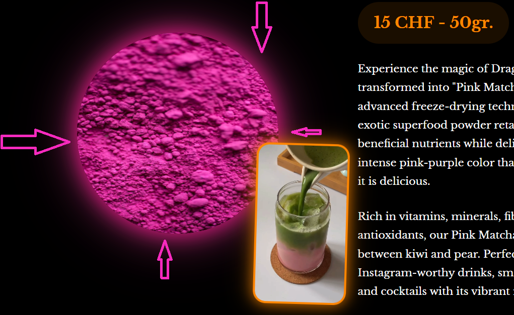 |  |

*Pulsing white glow effect that intensifies and fades every 2 seconds*

</div>

- **Pulsing Glow:** White glow intensifies and fades every 2 seconds
- **Black Text Core:** High contrast black text with white outline
- **Hover Acceleration:** Faster animation on hover interaction
- **Mobile Optimization:** Reduced glow intensity for performance

### SVG Logo Animations
- **Steam Animation:** Gentle floating motion using CSS transforms
- **Hover Effects:** Logo rotation and scaling on interaction
- **Drop Shadow:** Dynamic shadow effects that respond to hover

### Mobile Menu Animations

<div align="center">

#### Hamburger Menu Transformation

| Closed State | Open State |
|-------------|------------|
|  | 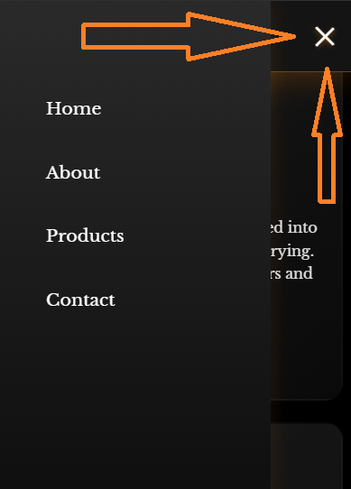 |

*Smooth transformation from hamburger lines to X when menu opens*

</div>

- **Hamburger Transform:** Lines rotate to form X when menu opens
- **Slide Animation:** Menu drawer slides with cubic-bezier easing
- **Overlay Fade:** Background overlay fades in/out smoothly
- **Color Change:** Lines change from orange to white when active

### Product Card Animations
- **Lift Effect:** Cards rise 15px on hover with enhanced shadows
- **Image Scaling:** Product images scale and rotate slightly on hover
- **Gradient Overlay:** Subtle color overlay that fades in
- **Border Highlight:** Orange border that appears on interaction

### Video Window Animations
- **Floating Effect:** Smooth up-and-down movement with rotation
- **Glow Pulsing:** Orange glow that intensifies and fades
- **Responsive Scaling:** Adapts animation to screen size

### Image Glow Effects
- **Pulsing Glow:** Orange glow pulses every 3 seconds
- **Multi-Layer Shadows:** 3 different glow intensities for realism
- **Hover Enhancement:** Stronger glow and scale on interaction
- **Border Animation:** Orange border with shadow effects

### Scroll Animations
- **autoShow:** Elements fade in and scale up as they enter viewport
- **View Timeline:** Modern CSS animation-timeline for scroll-triggered effects

## Deployment Instructions

### Prerequisites
- Modern web browser (Chrome, Firefox, Safari, Edge)
- Basic understanding of HTML/CSS file structure
- VS Code or similar text editor (recommended)

### Local Development Setup
1. **Create Project Structure:**
   ```bash
   mkdir hype-coffee-website
   cd hype-coffee-website
   mkdir -p assets/css assets/images assets/videos
   ```

2. **Add Files:**
   - Copy `index.html` to root directory
   - Copy product pages (`pink-matcha.html`, `cold-brew-special.html`, `valenio-wholesale.html`)
   - Copy `style.css` to `assets/css/`
   - Copy `README.md` to root directory
   - Add your coffee images to `assets/images/`
   - Add video files to `assets/videos/`

3. **Open in Browser:**
   - Double-click `index.html`, or
   - Use VS Code Live Server extension (recommended)

### Cloud Deployment Options

#### GitHub Pages (Recommended)

<div align="center">

#### Deployment Configuration

| GitHub Pages Setup | Branch Configuration |
|-------------------|---------------------|
|  |  |

*GitHub Pages deployment configuration showing automated hosting setup*

</div>

1. Create new GitHub repository
2. Upload all project files
3. Go to Settings → Pages
4. Select source branch (main/master)
5. Access at: `https://yourusername.github.io/repository-name`

#### Alternative Hosting Platforms
- **Netlify:** Drag-and-drop deployment with automatic SSL
- **Vercel:** Git-based deployment with preview branches
- **Traditional Hosting:** Upload via FTP to any web hosting service

### Pre-Deployment Checklist
- [x] All file paths are correct and case-sensitive
- [x] SVG graphics display correctly across browsers
- [x] Hamburger menu functions properly on mobile
- [x] Neon pulse animation works smoothly
- [x] Image glow effects display correctly
- [x] Video window displays correctly (if applicable)
- [x] Google Maps address link works
- [x] All product page links work correctly
- [x] Order buttons redirect to contact form
- [x] Text visibility is good on all backgrounds
- [x] Website displays correctly on all target devices

## Testing & Quality Assurance

### Validator Testing

**Validator:** All pages were tested separately.

<div align="center">

#### HTML & CSS Validation Results

| Test Type | Initial Result | Final Result |
|-----------|---------------|--------------|
| **Main HTML** | 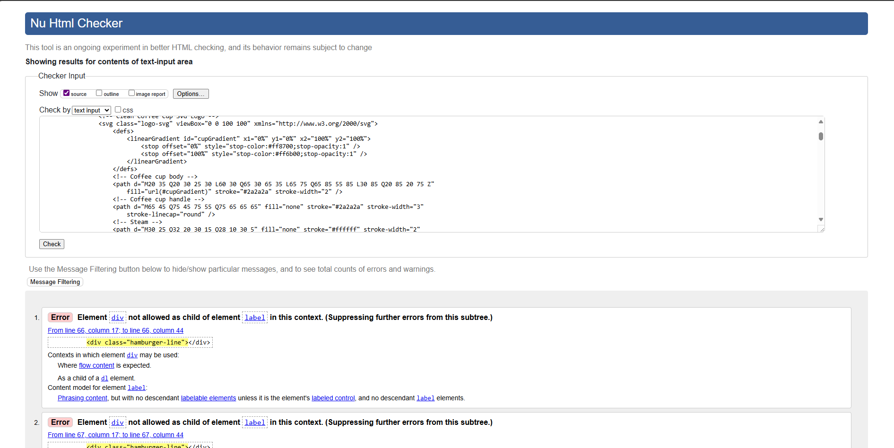 | 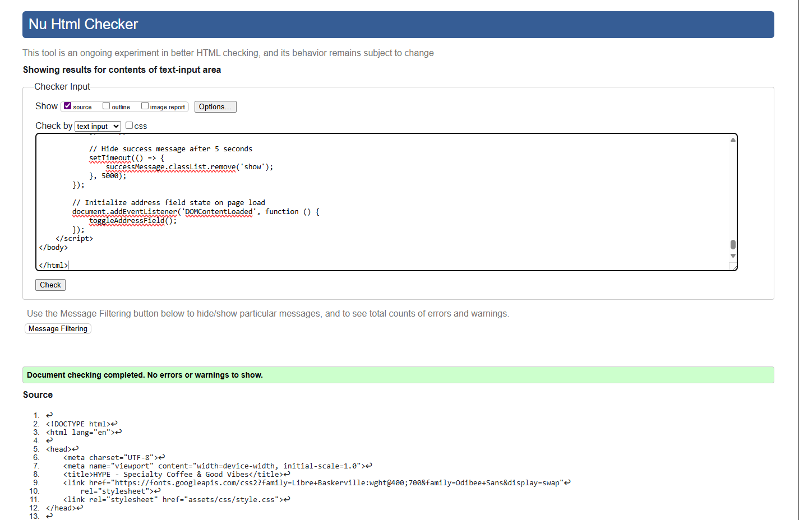 |
| **CSS Validation** | 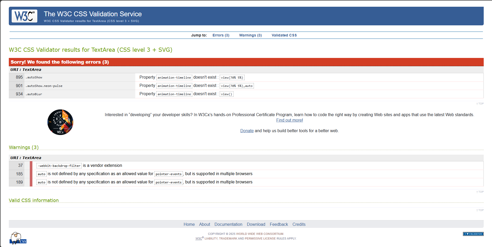 | 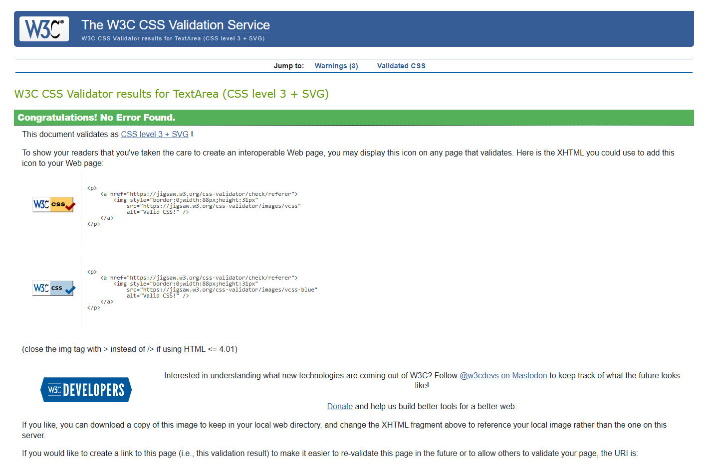 |
| **Links** | **[Validate Your HTML →](https://validator.w3.org/nu/#textarea)** | **[Validate Your CSS →](https://jigsaw.w3.org/css-validator/validator)** |

*Before and after validation results showing successful error resolution*

</div>

**Individual Page Validation Results:**

<div align="center">

| Pink Matcha HTML | Cold Brew HTML | Valenio Wholesale HTML |
|-----------------|----------------|----------------------|
| 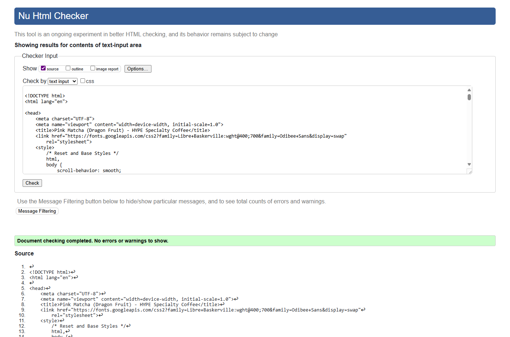 | 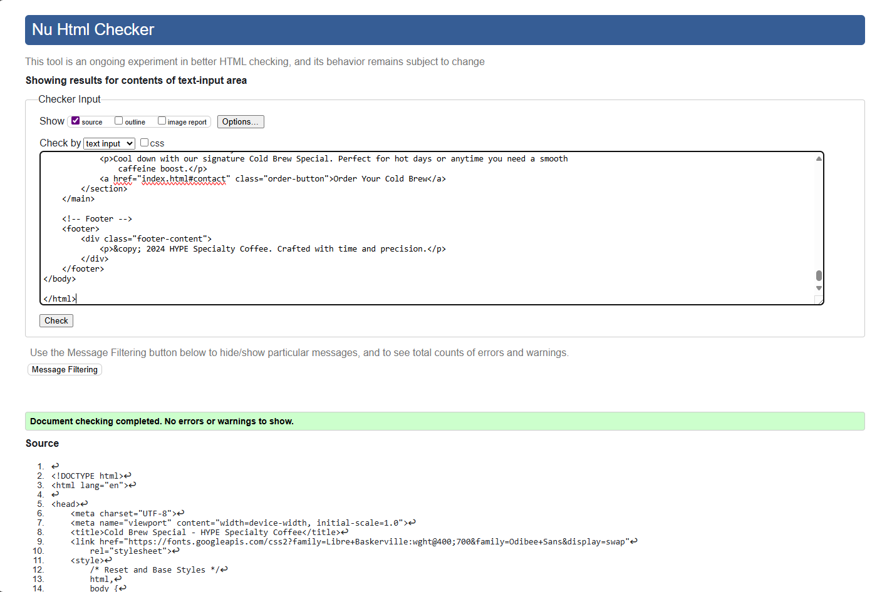 | 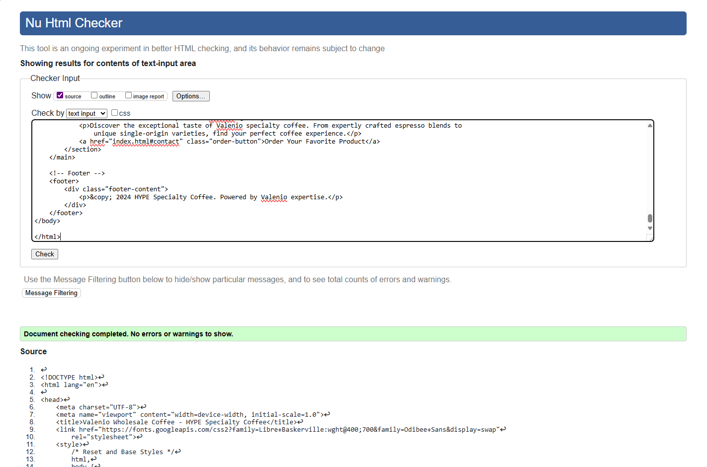 |
| **[Validate Pink Matcha →](https://validator.w3.org/nu/#textarea)** | **[Validate Cold Brew →](https://validator.w3.org/nu/#textarea)** | **[Validate Valenio →](https://validator.w3.org/nu/#textarea)** |

*All product pages successfully validated with no errors*

</div>

- [x] **Main HTML** - Successfully fixed validation errors
- [x] **CSS** - Successfully fixed validation errors  
- [x] **Pink Matcha HTML** - Passed validation
- [x] **Cold Brew HTML** - Passed validation
- [x] **Valenio Wholesale Coffee HTML** - Passed validation

### Enhanced Testing Checklist
- [x] All three product pages load correctly
- [x] Product descriptions are clearly visible
- [x] Video integration works (Pink Matcha)
- [x] Order buttons redirect to contact form
- [x] Mobile hamburger menu functions
- [x] Neon pulse animation displays correctly
- [x] Image glow effects work smoothly
- [x] Google Maps address link opens correctly
- [x] All gradient backgrounds render properly
- [x] Cross-page navigation works seamlessly

### Cross-Browser Testing
Test all features in:
- [x] **Google Chrome (latest)** - Full feature support
- [x] **Mozilla Firefox (latest)** - SVG and backdrop-filter support
- [x] **Safari (if using Mac)** - Webkit animations and iOS testing
- [x] **Microsoft Edge (latest)** - Modern CSS features
- [x] **Mobile browsers** (iOS Safari, Chrome Mobile)

### Mobile Testing Priority
- [x] Three-product layout on mobile
- [x] Hamburger menu touch responsiveness
- [x] Video window responsive behavior
- [x] Order button functionality
- [x] Text readability on small screens
- [x] Address link opens maps app properly

### Performance Testing

<div align="center">

#### Website Performance Analysis

| Desktop Performance | Mobile Performance |
|-------------------|------------------|
| 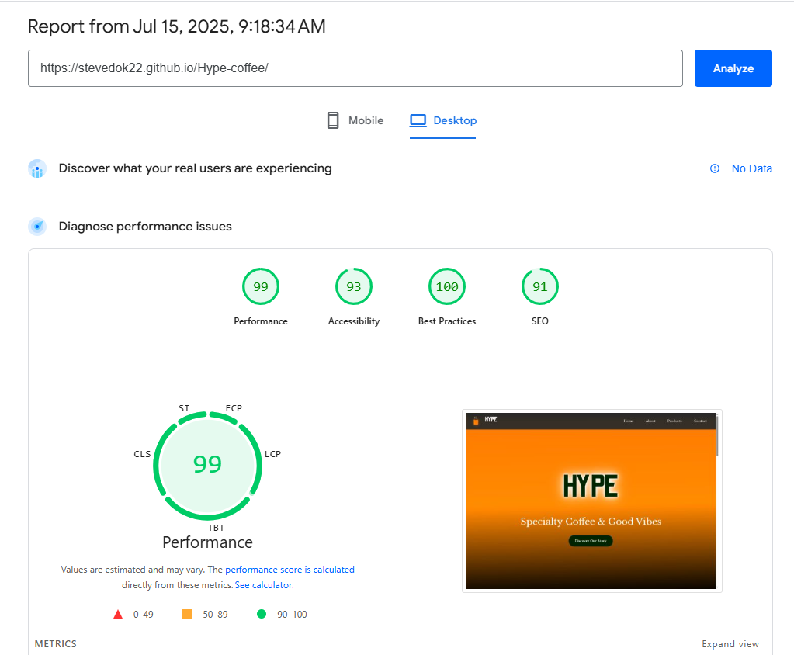 | 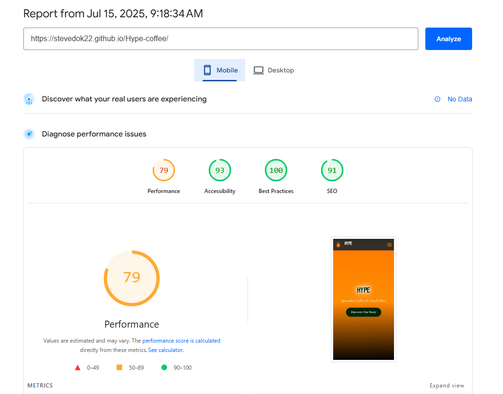 |
| **[Test Desktop Performance →](https://pagespeed.web.dev/analysis/https-stevedok22-github-io-Hype-coffee/0hmd3jrvcx?form_factor=desktop)** | **[Test Mobile Performance →](https://pagespeed.web.dev/analysis/https-stevedok22-github-io-Hype-coffee/0hmd3jrvcx?form_factor=mobile)** |

*Performance testing results showing optimized loading times and smooth animations*

</div>

- [x] Page loading speed with all assets
- [x] Video loading and playback
- [x] Animation performance on mobile
- [x] CSS transitions smoothness
- [x] Image optimization and loading

## Future Enhancement Opportunities

### Planned Website Improvements
- **E-commerce Integration:** Full online shopping cart and payment processing
- **Customer Reviews:** Product reviews and ratings system
- **Blog Section:** Coffee education and company news
- **Loyalty Program:** Digital rewards system
- **Live Chat:** Customer service integration
- **Multi-language Support:** English/German/French versions

### Technical Upgrades
- **Progressive Web App:** Offline functionality and app-like experience
- **Advanced Analytics:** Detailed user behavior tracking
- **Content Management System:** Easy content updates
- **API Integration:** Real-time inventory and pricing
- **Advanced Video Features:** Multiple video formats and quality options

### Product Expansion
- **Seasonal Products:** Limited-time offerings
- **Coffee Subscription:** Monthly coffee delivery service
- **Merchandise:** Branded coffee accessories
- **Virtual Coffee Classes:** Online brewing workshops
- **Corporate Packages:** Business coffee solutions

## Business Information

### Location
**HYPE Specialty Coffee & Good Vibes**

- **Address:** Universitätstrasse 41, 8006 Zurich, Switzerland
- **Phone:** (+41) 76 502 22 53
- **Email:** hello@hypecoffee.com
- **Hours:**
  - Monday - Friday: 7:30 AM - 6:00 PM
  - Saturday - Sunday: 9:00 AM - 4:00 PM

### Social Media

<div align="center">

**Instagram:**  
[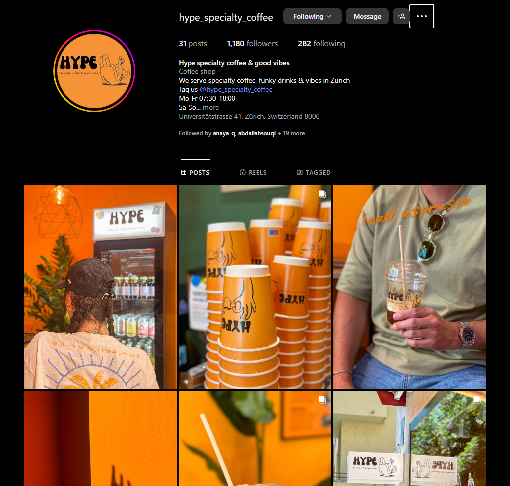](https://www.instagram.com/hype_specialty_coffee?utm_source=ig_web_button_share_sheet&igsh=MXpobGpncTlub2x4)

**Facebook:**  
[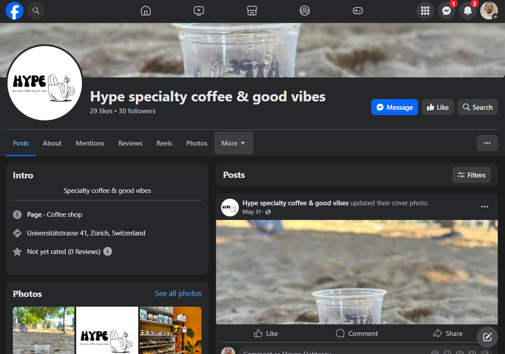](https://www.facebook.com/profile.php?id=100068255355285)

**Twitter:** Coming Soon

</div>

## Credits & Attribution

### Image & Video Sources

**Authentic Content (95% of images):**
- **Coffee Shop Photography:** Original images provided directly by HYPE Specialty Coffee shop owner
- **Product Images:** Authentic product photography from real coffee operations
- **Behind-the-Scenes Content:** Genuine workspace and preparation images

**Partner Collaborations:**
- **Dragon Fruit Powder (Pink Matcha):** Product images and information sourced from official partner
  - [Tea Route - Dragon Fruit Powder](https://www.tearoute.gr/dragon-fru-powder/p/973/107,142/)
- **Valenio Wholesale Coffee:** Professional coffee images and expertise content from certified partner
  - [Valenio Coffee - Wholesale Division](https://www.valenio.coffee/%CF%87%CE%BF%CE%BD%CE%B4%CF%81%CE%B9%CE%BA%CE%AE/)

**Video Content Sources:**

<div align="center">

#### Pink Matcha Preparation Video

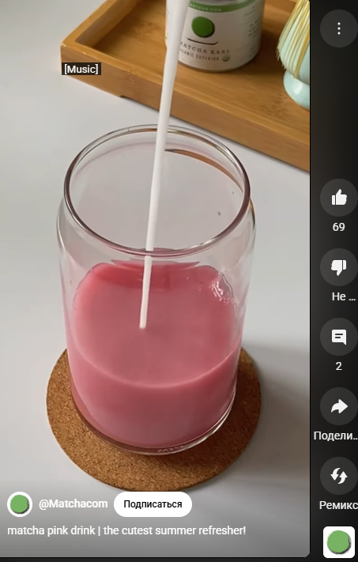

**Original content from Tea Route partner**
- **Source:** [YouTube Shorts - Matcha Preparation](https://www.youtube.com/shorts/C_4RpDdhvCM)
- **File:** `MatchaVideo.MP4` (converted for web optimization)
- **Features:** Vertical video window with floating animation and orange glow effects

</div>

<div align="center">

#### Valenio Coffee Roasting Process

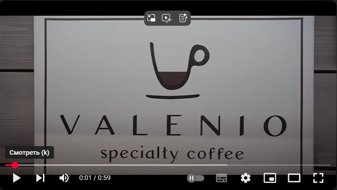

**Professional roasting demonstration**
- **Source:** [YouTube - Valenio Coffee Roasting](https://www.youtube.com/watch?v=5Mv8Z4lGSA4&ab_channel=Valenio-ValantisLamprianidis)
- **Official content:** Valenio-Valantis Lamprianidis channel
- **Content:** Expert coffee roasting techniques and 20+ years of experience

</div>

### External Resources
**Google Fonts:**
- Libre Baskerville (Open Font License)
- Odibee Sans (Open Font License)  
- Font Loading: Optimized with display=swap parameter

### Custom Development
- **SVG Graphics:** Hand-crafted logo and illustrations
- **Video Integration:** Custom vertical video window with animations
- **Enhanced Text Visibility:** Improved contrast and shadow techniques
- **Neon Pulse Animation:** Custom CSS keyframes with pulsing glow effects
- **Hamburger Menu:** Pure CSS push menu implementation
- **Glow Effects:** Multi-layer shadow techniques
- **Product Portfolio:** Streamlined three-product showcase
- **Cross-Page Navigation:** Seamless order flow implementation
- **Responsive Design:** Mobile-first approach with scalable elements

### JavaScript Implementation

<div align="center">

#### Contact Form Interactive Features

| Form States | Dynamic Address Field |
|------------|----------------------|
|  |  |

*Dynamic form interactions with delivery address toggle and success messaging*

</div>

**Interactive Functionality:**
- **Dynamic Address Field:** Shows/hides delivery address based on order type selection
- **Form Validation:** Real-time form validation and user feedback
- **Success Messaging:** Animated success confirmation with auto-hide functionality
- **Form Reset:** Automatic form clearing after successful submission
- **Source:** [YouTube Shorts - Matcha Preparation](https://www.youtube.com/watch?v=unEdnHC2BAs)
```javascript
// Contact form delivery address toggle functionality
function toggleAddressField() {
    const orderType = document.getElementById('order-type').value;
    const addressField = document.getElementById('addressField');
    
    if (orderType === 'delivery') {
        addressField.classList.add('show');
        document.getElementById('delivery-address').required = true;
    } else {
        addressField.classList.remove('show');
        document.getElementById('delivery-address').required = false;
    }
}

// Form submission handling with user feedback
document.getElementById('contactForm').addEventListener('submit', function (e) {
    e.preventDefault();
    const successMessage = document.getElementById('successMessage');
    const form = document.getElementById('contactForm');
    
    successMessage.classList.add('show');
    setTimeout(() => {
        form.reset();
        toggleAddressField();
    }, 1000);
    
    setTimeout(() => {
        successMessage.classList.remove('show');
    }, 5000);
});
```

**Technical Approach:**
- **CSS-First Design:** Minimal JavaScript usage prioritizing CSS solutions
- **Progressive Enhancement:** Core functionality works without JavaScript
- **Event-Driven Interactions:** Modern DOM event handling
- **Accessibility-Focused:** Form interactions maintain keyboard navigation support

### Code Quality Standards
- **Clean Code:** Enhanced readability and maintainability across all pages
- **Advanced Documentation:** Comprehensive commenting for all features
- **Modern CSS:** Latest features including improved text visibility techniques
- **Performance Optimized:** Efficient animations and video integration
- **Mobile Optimized:** Touch-friendly interface with enhanced readability
- **Minimal JavaScript:** Only essential interactivity with graceful degradation

### Content Authenticity
**95% Real Business Content:**
- All coffee shop images are authentic and represent actual HYPE operations
- Product images showcase real items available for purchase
- Partner content verified and sourced from official business channels
- Video content demonstrates actual preparation and roasting processes
- Business information and pricing reflect current offerings

## References & Learning Resources

### HTML & CSS Fundamentals
- **MDN Web Docs** - HTML Elements Reference
  - Used for semantic HTML5 structure and accessibility guidelines
  - [https://developer.mozilla.org/en-US/docs/Web/HTML](https://developer.mozilla.org/en-US/docs/Web/HTML)

- **CSS-Tricks** - Complete Guide to CSS Grid and Flexbox
  - Referenced for responsive layout implementation
  - [https://css-tricks.com/snippets/css/complete-guide-grid/](https://css-tricks.com/snippets/css/complete-guide-grid/)

### Animation & Interactive Effects

- **CSS-Tricks** - "How to Create Neon Text With CSS"
  - Advanced text-shadow techniques for realistic neon effects
  - [https://css-tricks.com/how-to-create-neon-text-with-css/](https://css-tricks.com/how-to-create-neon-text-with-css/)

- **W3Schools** - "How To Create a Glowing Text"
  - Basic neon text implementation with CSS animations
  - [https://www.w3schools.com/howto/howto_css_glowing_text.asp](https://www.w3schools.com/howto/howto_css_glowing_text.asp)

- **CodePen** - Neon Text Effects Collection
  - Interactive examples of CSS neon animations
  - [https://codepen.io/AllThingsSmitty/pen/VzXrgY](https://codepen.io/AllThingsSmitty/pen/VzXrgY)

- **Red Stapler** - "Realistic CSS Neon Text Effect Tutorial"
  - Multi-layered shadow techniques for authentic neon appearance
  - [https://redstapler.co/realistic-css-neon-text-effect-tutorial/](https://redstapler.co/realistic-css-neon-text-effect-tutorial/)

- **Daily Dev Tips** - "CSS Neon Animation Tutorial"
  - Neon flicker effects and glitch animations
  - [https://daily-dev-tips.com/posts/css-neon-animation/](https://daily-dev-tips.com/posts/css-neon-animation/)

- **Tiny.cloud** - "Neon Fonts and Glowing Text Guide"
  - Font selection and pulsating animation techniques
  - [https://www.tiny.cloud/blog/neon-fonts-and-glowing-text-get-started-in-two-steps/](https://www.tiny.cloud/blog/neon-fonts-and-glowing-text-get-started-in-two-steps/)

### Mobile Navigation & Hamburger Menus

- **W3Schools** - "How To Create a Responsive Top Navigation Menu"
  - Foundation for responsive navigation with JavaScript
  - [https://www.w3schools.com/howto/howto_js_topnav_responsive.asp](https://www.w3schools.com/howto/howto_js_topnav_responsive.asp)

- **Medium** - "Responsive Hamburger Menu Tutorial" by Miguel Nunez
  - HTML, CSS, and JavaScript implementation guide
  - [https://medium.com/@codefoxx/how-to-create-a-responsive-hamburger-menu-with-html-css-javascript-4dc10a45d3](https://medium.com/@codefoxx/how-to-create-a-responsive-hamburger-menu-with-html-css-javascript-4dc10a45d3)

- **DEV Community** - "Responsive Navbar and Hamburger Menu"
  - Pure CSS hamburger menu without JavaScript
  - [https://dev.to/devggaurav/let-s-build-a-responsive-navbar-and-hamburger-menu-using-html-css-and-javascript-4gci](https://dev.to/devggaurav/let-s-build-a-responsive-navbar-and-hamburger-menu-using-html-css-and-javascript-4gci)

- **Alvaro Trigo's Blog** - "10+ Hamburger Menu Examples [CSS Only]"
  - Collection of CSS-only hamburger menu implementations
  - [https://alvarotrigo.com/blog/hamburger-menu-css/](https://alvarotrigo.com/blog/hamburger-menu-css/)

- **Medium** - "CSS-only Hamburger Menu" by threkk
  - Checkbox-based hamburger menu technique
  - [https://threkk.medium.com/how-to-make-a-css-only-hamburger-menu-f7ad41e13399](https://threkk.medium.com/how-to-make-a-css-only-hamburger-menu-f7ad41e13399)

### CSS Grid & Flexbox Layout

- **CSS-Tricks** - "Complete Guide to CSS Grid"
  - Comprehensive guide to CSS Grid properties and techniques
  - [https://css-tricks.com/snippets/css/complete-guide-grid/](https://css-tricks.com/snippets/css/complete-guide-grid/)

- **MDN Web Docs** - "CSS Grid Layout"
  - Official documentation for CSS Grid specifications
  - [https://developer.mozilla.org/en-US/docs/Web/CSS/CSS_grid_layout](https://developer.mozilla.org/en-US/docs/Web/CSS/CSS_grid_layout)

- **W3Schools** - "CSS Grid Layout"
  - Basic grid layout implementation and examples
  - [https://www.w3schools.com/css/css_grid.asp](https://www.w3schools.com/css/css_grid.asp)

- **MDN** - "Realizing Common Layouts Using Grids"
  - Practical grid layout patterns and responsive techniques
  - [https://developer.mozilla.org/en-US/docs/Web/CSS/CSS_grid_layout/Realizing_common_layouts_using_grids](https://developer.mozilla.org/en-US/docs/Web/CSS/CSS_grid_layout/Realizing_common_layouts_using_grids)

- **GeeksforGeeks** - "How to Create a Responsive CSS Grid Layout"
  - Grid responsiveness with auto-fit and auto-fill
  - [https://www.geeksforgeeks.org/css/how-to-create-a-responsive-css-grid-layout/](https://www.geeksforgeeks.org/css/how-to-create-a-responsive-css-grid-layout/)

- **Medium** - "Mastering CSS Grid" by Make Computer Science Great Again
  - Advanced grid concepts and modern web layouts
  - [https://medium.com/@MakeComputerScienceGreatAgain/mastering-css-grid-a-short-tutorial-for-modern-web-layouts-a69f1025639e](https://medium.com/@MakeComputerScienceGreatAgain/mastering-css-grid-a-short-tutorial-for-modern-web-layouts-a69f1025639e)

### SVG Graphics & Icons

- **SVG Tutorial Resources**
  - Basic SVG path creation and animation techniques
  - Coffee cup icon design principles
  - Steam animation using CSS transforms

### Color Theory & Design

- **Adobe Color** - Color palette generation and harmony
  - Orange and black color scheme development
  - Accessibility color contrast checking
  - [https://color.adobe.com/](https://color.adobe.com/)

- **Coolors.co** - Color palette inspiration
  - Used for generating complementary colors for gradients
  - [https://coolors.co/](https://coolors.co/)

### Coffee Industry Research
- **Specialty Coffee Association** - Industry terminology and standards
- **Coffee Business Magazine** - Market trends and customer preferences

### Development Tools & Workflow

- **Visual Studio Code** - Development environment
- **Live Server Extension** - Local development testing
- **Chrome DevTools** - Responsive design testing
- **Firefox Developer Tools** - CSS Grid inspection

### Problem-Solving Resources

- **Stack Overflow** - Common CSS and HTML issues
- **freeCodeCamp** - Web development fundamentals
- **The Odin Project** - Full-stack development curriculum

## AI-Assisted Development

### ChatGPT 
- **OpenAI ChatGPT** - Code review, debugging assistance, and documentation help
  - CSS troubleshooting and optimization suggestions
  - HTML structure validation and best practices
  - Responsive design problem-solving
  
© 2024 HYPE Specialty Coffee. Website designed and developed with passion for great coffee, good vibes, streamlined product focus, and cutting-edge web technology.